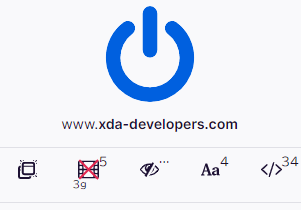

***

<h1 align="center">

uBlock 🦆 (uBlock Origin - experimental fork)
</h1>

## License

[GPLv3](./LICENSE.txt). Original Licensor <https://github.com/gorhill/uBlock>  

***

## フォーク元からの変更点

### 回線速度に応じた`no-large-media`適用切り替え

**(Chromium only)**  
[Navigator.connection](https://developer.mozilla.org/en-US/docs/Web/API/Navigator/connection) を参照して「xx KBより大きいメディア要素をブロックする」の適用を動的に切り替える。※ダッシュボードでの設定はONしておく必要がある

備考：ブラウザーからの情報変化イベント([onchange](https://developer.mozilla.org/en-US/docs/Web/API/NetworkInformation/onchange))で切り替えるため、特に安定しない通信回線ではページ読込中に変化する可能性がある(?)。  
ポップアップに状態表示(`navigator.connection.effectiveType`)しており、値が「4g」では非適用、それ以外は適用としている。＜[仕様](https://wicg.github.io/netinfo/#dfn-effective-connection-type)。ただしブラウザー実装が仕様に従っているか不明＞

***
